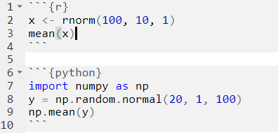

# Preparing the working environment

If you have not already done that, you may use the `Terminal` panel of
RStudio to access bash and use `git` to checkout the course repository into
your working directory:

```{bash, eval = FALSE, class.source="bashchunk"}
cd ~/workdir
git clone https://github.com/fmicompbio/adv_singlecell_2022.git
```


# Introduction

In this problem-based tutorial, we will work with RStudio as an editor and use
its support for code from different languages, in particular R and Python.

## Useful links

These might help you if you get stuck in solving the problems below, or for
future reference:

- "R Markdown: The Definitive Guide" (free online book): https://bookdown.org/yihui/rmarkdown/
- `knitr` chunk options: https://yihui.org/knitr/options/
- `reticulate` documenation (R interface to Python): https://rstudio.github.io/reticulate/
- `reticulate` and sparse matrices: https://rstudio.github.io/reticulate/articles/calling_python.html#sparse-matrices
- `reticulate` webinar: https://resources.rstudio.com/webinars/r-python-in-rstudio-1-2-with-reticulate
- "Debunking the R vs. Python Myth" webinar: https://www.rstudio.com/resources/webinars/debunking-the-r-vs-python-myth/
- PyCon.DE 2018: "Reticulate: R Interface To Python" (presentation by Jens Bruno Wittek): https://www.youtube.com/watch?v=EJxQSa9lwfM
- Tutorial for using Python in RStudio: https://docs.rstudio.com/tutorials/user/using-python-with-rstudio-and-reticulate/
- `SciPy` documenation: https://docs.scipy.org/doc/scipy/reference/
- `pandas.DataFrame` documentation: https://pandas.pydata.org/pandas-docs/stable/reference/api/pandas.DataFrame.html
- `matplotlib` documentation: https://matplotlib.org/
- `ggplot2` documentation: https://ggplot2.tidyverse.org/


## Using `Rmarkdown` in RStudio

### `Rmarkdown` documents

In this tutorial you should create an `Rmarkdown` document (`.Rmd` file
extension), which is a `markdown` document (plain text with human-friendly
formatting cues, see this [article](https://en.wikipedia.org/wiki/Markdown)
on Wikipedia) that can include chunks of code.

When the document is rendered into a pretty output format (for example HTML, PDF
or Word), the code is run and its output (text or figures) is captured and
included in the output file. This makes it a great tool to document and share
reproducible analyses.

### Defining code chunks 

For code chunks, multiple languages are supported by RStudio (see
[link](https://bookdown.org/yihui/rmarkdown/language-engines.html) for a list).
Code chunks are delineated by three backticks (<span class="pre">```</span>), and
the language is defined in the header:  
{width=396px}

In addition to the language, additional options that apply to that chunk can
be defined in the header, such as:  

- `fig.width` and `fig.height` control the dimensions of generated figures
- `warnings=FALSE` suppresses warnings
- `echo=FALSE` hides the code in the output
- `eval=FALSE` does not run a code chunk

You can find more details on chunk options supported by `knitr`,
RStudio's default engine, [here](https://yihui.org/knitr/options/).

I use different background colors to indicate code chunks for different
languages. These will only become visible in the rendered output document and
are defined in a CSS file (selected by `class.source`).

```{r, eval=FALSE, class.source="rchunk"}
# R code
R.version.string
```

```{python, eval=FALSE, class.source="pythonchunk"}
# python code
import sys
sys.version
```

```{bash, eval=FALSE, class.source="bashchunk"}
# shell script (bash)
echo ${BASH_VERSION}
```


## Connecting RStudio to Python with `reticulate`

{width=200px}

Combining R and Python is made possible using the [reticulate](https://rstudio.github.io/reticulate/)
package. It has been created by developers at RStudio (JJ Allaire and Kevin Ushey)
and is compatible with Python >= 2.7 and numpy >= 1.6.

It can be installed from [CRAN](https://cran.r-project.org/) using the code below
(this is not needed on your virtual machine - it is already installed):   
```{r, eval=FALSE, class.source="rchunk"}
install.packages("reticulate")
```


### Selecting which Python to use

The Python instance to be used by [reticulate](https://rstudio.github.io/reticulate/)
should be selected at the beginning of an analysis, before the Python process is started.

You can use `py_available()` to check if Python is available on the system and
has already been initialized, and `py_discover_config()` if you want to select
one from several potential Python instances that provides specific required modules:
```{r, class.source="rchunk"}
# load reticulate package
library(reticulate)

# check if Python is available and has already been initialized
py_available()

# discover Python that provides "numpy"
py_discover_config(required_module = "numpy")
```

By default, [reticulate](https://rstudio.github.io/reticulate/) uses the version
of Python found on your PATH (i.e. `Sys.which("python")`).
The `use_python()` function, or the `RETICULATE_PYTHON` environment variable
enable you to specify an alternate version.

You can also use Python from a virtual or `Conda`
environment using the `use_virtualenv()` and `use_condaenv()` functions. See
this [link](https://rstudio.github.io/reticulate/articles/versions.html) for
more details.

Finally, environments can also be created, and Python packages can be installed or
removed, from within R using the following functions:  

- *Conda environments*: `conda_create()`, `conda_install()`, `conda_remove()`  
- *Virtual environments*: `virtualenv_create()`, `virtualenv_install()`, `virtualenv_remove()`
- *active environment* (or if unset, the `r-reticulate` environment): `py_install()`

For this course, the virtual machine has all required Python packages already
installed into the `conda` environment `"day1_RNA_velocity"`. We will select
this using `use_condaenv()` below.

On my local server, which I use to write this documentation, I am using a
different environment that is configured in a local file (`FMI_python_config.R`).

Finally, after we have selected a Python environment or path using one of the
above mechanisms, we can use `py_config()` to connect to it. If you run
`py_config()` and Python bindings have not been initialized yet, they
will be initialized by that function:
```{r selectPython, class.source="rchunk"}
# set Python env (only needed on server xenon6)
if (file.exists("FMI_python_config.R")) {
    # setup for FMI server
    source("FMI_python_config.R")
} else {
    # setup for cloud VM
    Sys.setenv(PYTHONPATH = "/home/rstudio/.local/share/r-miniconda/envs/day1_python_and_R/lib/python3.8/site-packages/")
    reticulate::use_condaenv("day1_RNA_velocity", required = TRUE)
}

# print config (will initialize Python bindings)
py_config()

# check if Python is available now
py_available()
```


### The `reticulate` Python engine

The integration of R and Python in RStudio is more sophisticated than that of
other languages that can be run in code chunks.
The Python engine from [reticulate](https://rstudio.github.io/reticulate/)
allows you to:

1. run Python chunks (single Python session connected to your R session, shared variables/state between Python chunks)
2. print Python output (including graphical output from [matplotlib](https://matplotlib.org/)
3. access Python objects from R (using the `py` object)
4. access R objects from Python (using the `r` object)


# Exercises

## Create a new `Rmarkdown` file
You can either write one from scratch or using RStudio's `File` --> `New File`.
The latter will pre-fill the document with sample content and is also helpful
to get you started with the `yaml` header (configure block at the top, separated
by the `---` marks).

All exercises can be written into this document.


## Add an R code chunk to the document that generates text and/or figure outputs
You can execute code interactively (line-by-line or the whole chunk), and
you can also compile the whole document (`Knit` button on top). It is good
practise to compile the whole document from time to time, and most importantly
at the end.


## Add an R code chunk that select and initializes Python
This code chunk should be one of the first in your document, and it should
contain this:
```{python py_config, eval=FALSE, class.source="pythonchunk"}
# set Python module path and select Python from conda environment
Sys.setenv(PYTHONPATH = "/home/rstudio/.local/share/r-miniconda/envs/day1_python_and_R/lib/python3.8/site-packages/")
reticulate::use_condaenv("day1_RNA_velocity", required = TRUE)

# print config (will initialize Python bindings)
py_config()

# check if Python is available now
py_available()
```

You know that this was successful if `py_available()` returns `TRUE`.

## Start an interactive Python prompt in your R console
- You can use `repl_python()` in your console to start a
  **R**read-**E**valuate-**P**rint **L**oop to interact with Python.
- Try to create some objects (e.g. `x = 1` or `a = [1, 2, 3]`).
- You can leave the loop by typing `exit`, which brings you back to the R console.

``````{comment}
```{python create_py_obj, class.source="pythonchunk"}
x = 1
a = [1, 2, 3]
```
``````

## Add a Python code chunk to your document
- This should be below the Python init block.
- Is it using the same Python process as the REPL above, or in other
  words, do the objects created in the REPL persist and are they available in
  a subsequent code chunk? Try to check this.

``````{comment}
```{python access_py_obj, class.source="pythonchunk"}
x
a
```
``````

You may have noticed that when you run a code chunk interactively in RStudio
(e.g. by pressing Ctrl-Enter, or clicking on the 'play' button), RStudio will
automatically enter the REPL and also leave it automatically again when you
run R code interactively.

## Do separate Python code chunks use the same Python process?
- Do objects created in one Python chunk persist and can they be accessed in
  a subsequent Python chunk? You can test this by adding two more Python chunks
  to your document and try it out.

``````{comment}
```{python block1, class.source="pythonchunk"}
x = 1
a = [1, 2, 3]
```
```{python block2, class.source="pythonchunk"}
x
a[1]
```
``````

## Access Python objects from an R code chunk
- In your R chunk, use the special `py` object to access objects that live in
  the Python process, for example `py$x`
- What is the R object type for different types of Python objects (e.g. `scalar`,
  `list`, `dict`, etc.)?

``````{comment}
```{python create_py_obj_types, class.source="pythonchunk"}
x = 1
a = [1, 2, 3]
d = {'a': 1, 'b': 'B'}

type(x)
type(a)
type(d)
```
```{r access_py_obj_types, class.source="rchunk"}
py$x
py$a
py$d

str(py$x)
str(py$a)
str(py$d)
```
``````

You may have observed that automated type conversions happen when you access
Python objects from R or vice versa. The following table summarizes the
currently supported conversions:

### Type conversions between R and Python
See also https://rstudio.github.io/reticulate/articles/calling_python.html#type-conversions

R                      Python            Examples
---------------------  ----------------- ---------------
Single-element vector  Scalar            1, 1L, TRUE, "foo"
Multi-element vector   List              c(1.0, 2.0, 3.0), c(1L, 2L, 3L)
List of multiple types Tuple             list(1L, TRUE, "foo")
Named list             Dict              list(a = 1L, b = 2.0), dict(x = x_data)
Matrix/Array           NumPy ndarray     matrix(c(1,2,3,4), nrow = 2, ncol = 2)
Data Frame             Pandas DataFrame  data.frame(x = c(1,2,3), y = c("a", "b", "c"))
Function               Python function   function(x) x + 1
Raw                    Python bytearray  as.raw(c(1:10))
NULL, TRUE, FALSE      None, True, False NULL, TRUE, FALSE

## Access R objects from an Python code chunk
- You may need to first create some R objects
- In your Python chunk, use the special `r` object to access objects that live in
  the Python process, for example `r.v`

Let's do some more exercises to illustrate object access:

- Create numerical vectors with 100 values drawn from normal
  distributions (choosing your own mean and standard deviation), one in R called
  `n1` and one in Python called `n2`. Hint: You can use the `rnorm()` function
  in R and the `numpy.random.normal()` function in Python to sample from a
  normal distribution.

``````{comment}
```{r, class.source="rchunk"}
n1 <- rnorm(100, 10, 1)
```
```{python, class.source="pythonchunk"}
import numpy as np
n2 = np.random.normal(20, 1, 100)
```
``````

- Calculate the mean of `n1` and `n2`, both in R and in Python. Hint: You can
  use the `mean()` and `numpy.mean()` functions in R and Python, respectively.
``````{comment}
```{r, class.source="rchunk"}
mean(n1)
mean(py$n2)
```
```{python, class.source="pythonchunk"}
np.mean(r.n1)
np.mean(n2)
```
``````

- Create a Python function that calculates and returns the mean of its argument,
  and call it from R. Hint: Python functions are defined using the `def` keyword,
  see for example https://www.w3schools.com/python/python_functions.asp
``````{comment}
```{python, class.source="pythonchunk"}
def pymean(z):
    return np.mean(z)

```
```{r, class.source="rchunk"}
py$pymean(n1)
py$pymean(py$n2)
```
``````

## Working with tabular data
You may have seen in the type conversion table above that an R `data.frame` is
represented in Python as a `pandas` `DataFrame` and vice versa. Let's explore
the automated conversion:

- Make the R built-in data.frame `iris` available in Python as `pyiris` and print
  its column names. Remark: if `pandas` is not available in Python, an R
  `data.frame` will be converted into a Python `dict`. Hint: you can find
  `pandas` `DataFrame` documentation [here](https://pandas.pydata.org/pandas-docs/stable/reference/api/pandas.DataFrame.html)
``````{comment}
```{r, class.source="rchunk"}
class(iris)
```
```{python, class.source="pythonchunk"}
pyiris = r.iris
# type(pyiris)
pyiris.columns
```
``````

- Print a concise summary of the data frame in either R or Python
``````{comment}
```{r, class.source="rchunk"}
summary(iris)
```
```{python, class.source="pythonchunk"}
pyiris.info()
```
``````

- Round-trip: Write `iris` from R into a csv file, read it back into `pyiris2`
  in Python and make available in R as `iris2`. Are the data types of the
  columns in `iris` and `iris2` identical?
``````{comment}
```{r, class.source="rchunk"}
fname <- tempfile()
write.csv(x = iris, file = fname, row.names = FALSE)
```
```{python, class.source="pythonchunk"}
import pandas as pd
pyiris2 = pd.read_csv(r.fname)
pyiris2.info()
```
```{r, class.source="rchunk"}
iris2 <- py$pyiris2
class(iris2)
summary(iris2)
```
``````

## Creating figures from R and Python code chunks
Plotting from Python using [matplotlib](https://matplotlib.org/) is also
supported. Let's create some plots from both environments:

- Using the `iris` data frame, create a scatter plot of "Sepal.Length" versus
  "Petal.Length" with points colored by "Species", in R and/or in Python.
  Use chunk options to control the size of the figures.

``````{comment}  
```{r, class.source="rchunk", fig.width=4.5, fig.height=5}
# base graphics
plot(iris$Sepal.Length, iris$Petal.Length, pch = 20,
     col = as.numeric(iris$Species) + 1,
     xlab = "Sepal length (mm)", ylab = "Petal length (mm)")
legend("topleft", levels(iris$Species), pch = 20, col = 2:4, bty = "n")
```

```{r, class.source="rchunk", fig.width=5, fig.height=4}
# ggplot2
library(ggplot2)
ggplot(iris, aes(x=Sepal.Length, y=Petal.Length, colour=Species)) +
         geom_point() +
         xlab("Sepal length (mm)") + ylab("Petal length (mm)")
```

```{python, class.source="pythonchunk", fig.width=4.5, fig.height=4.5}
import matplotlib
import matplotlib.pyplot as plt

groups = pyiris.groupby('Species')

fig, ax = plt.subplots()

for name, group in groups:
    ax.scatter(x = group["Sepal.Length"], y = group["Petal.Length"], label=name)
ax.legend()

ax.set_xlabel('Sepal length (mm)', fontsize=12)
ax.set_ylabel('Petal length (mm)', fontsize=12)
plt.show()
```
``````

## Working with arrays

Here is a quick summary of how R and Python differ in the way they represent
arrays. For a more detailed discussion see this
[link](https://rstudio.github.io/reticulate/articles/arrays.html).

Dense data (for example a matrix or 2-dimensional array) are stored contiguously
in memory. Array memory ordering schemes translate for example a (row,column)
index to a memory address.

R and Python differ in their memory ordering schemes: R is so called
"column-major", meaning that data is layed-out in memory such that the first
coordinate is the one changing fastest. The matrix element `x[i, j]`
for example can be found at the address offset `a = i + (j - 1) * nrow(x)`.

Python/`NumPy` can store arrays both in "column-major" and also "row-major"
form, but it defaults to the "row-major" format.
In a row-major layout, the above example element `x[i, j]` would be found at
offset `a = j + (i - 1) * ncol(x)`.

If you are using/addressing arrays both in Python and R, it is good to know:  

- Dense R arrays are presented to Python/`NumPy` as column-major `NumPy`
  arrays.  
- All `NumPy` arrays (column-major, row-major, otherwise) are presented to R
  as column-major arrays, because that is the only kind of dense array that R
  understands.  
- R and Python print arrays differently.

The different order of printing may be especially confusing, as illustrated in
the exercise below:

- Create a 4 by 3 by 2 (3-dimensional) array containing the numbers 1 to 24 in
  both Python and R. Hint: in Python, you can use `numpy.arrange` to create the
  data vector and `numpy.reshape(..., order = "F")` to "fold" it into the
  desired dimensions (the Fortran-order is required to make it consistent with
  R). In R, you can use `1:24` to create the data and `array` to fold it.
``````{comment}
```{python, class.source="pythonchunk"}
import numpy as np
aP = np.reshape(np.arange(1,25), (4,3,2), "F")
```
```{r, class.source="rchunk"}
aR <- array(1:24, c(4,3,2))
```
``````
- Print both in each of the two environments
``````{comment}
```{r, class.source="rchunk"}
aR
py$aP
```
```{python, class.source="pythonchunk"}
r.aR
aP

r.aR.flags
aP.flags
```
``````

- From both environments, print values along just the first index of
  the first dimension (remember that indexing in R starts at 1 and in Python at 0)
``````{comment}
```{r, class.source="rchunk"}
# compare the sub-arrays at the first index of the first dimension
aR[1, , ]
py$aP[1, ,]
```
```{python, class.source="pythonchunk"}
# compare the sub-arrays at the first index of the first dimension
r.aR[0]
aP[0]
```
``````


## Working with sparse matrices

If [scipy](https://scipy.org/) is installed, 
[reticulate](https://rstudio.github.io/reticulate/) will automatically convert
R `dgcMatrix` sparse matrix objects to
[SciPy CSC matrix](https://docs.scipy.org/doc/scipy/reference/generated/scipy.sparse.csc_matrix.html)
objects. Without a working [scipy](https://scipy.org/) installation, the
conversion will fail with a "cannot convert object" error. For details see
https://rstudio.github.io/reticulate/articles/calling_python.html#sparse-matrices

- Load the `Matrix` package in R and create a sparse matrix
``````{comment}
```{r, class.source="rchunk"}
# load Matrix package and create sparse matrix A
library(Matrix)
i <- c(1,3:8)
j <- c(2,9,6:10)
x <- 7 * (1:7)
A <- sparseMatrix(i, j, x = x)
A
```
``````
- Access the R sparse matrix from a Python chunk
``````{comment}
```{python, class.source="pythonchunk"}
# automatic conversion to SciPy CSC matrix (requires scipy)
r.A
r.A.shape
```
``````
- Explicitely convert the R sparse matrix to a Python object in an R chunk,
  using the `r_to_py` function. How does it differ from the R matrix? Which
  process manages the memory allocated for the object?
``````{comment}
```{R, class.source="rchunk"}
s1 <- r_to_py(A, convert = FALSE)
s1
class(s1)

A
class(A)
```
``````

# Final remarks

- By default when Python objects are returned to R they are converted to
  their equivalent R types and thus copied. There are ways to prevent that and
  access the Python object and its methods and properties just as if it was an
  instance of an R reference class. This may be especially relevant for large
  objects requiring a substantial fraction of the available memory. See also the
  `convert` argument of the `py_to_r()` function and 
  https://rstudio.github.io/reticulate/articles/calling_python.html#object-conversion
- R and Python use different default numeric types: Both `3` and `3.0` are
  interpreted as floating point numbers in R (compare `class(3)` with
  `class(3.0)` and `class(3L)`). In Python, `3` is interpreted as an integer,
  and `3.0` as a floating point number. If Python expects an integer, make sure
  to add L in R (e.g. `3L`).  
- Python uses 0-based indices, while R uses 1-based.  
- Dots ('.') are not allowed in object names in Python. To avoid any issues, it
  is best to use names for your R objects without any dots.  


# Session info
It's good practise to include information on all used software and their version
at the end of an Rmarkdown document. For R, we can use the built-in
`sessionInfo()` function (or if you prefer the [sessioninfo](https://cran.rstudio.com/web/packages/sessioninfo/index.html)
package), for Python we can for example use the `sinfo` package:  

## R
```{r, class.source="rchunk"}
date()
sessionInfo()
```

## Python
```{python, class.source="pythonchunk"}
from sinfo import sinfo
sinfo()
```
